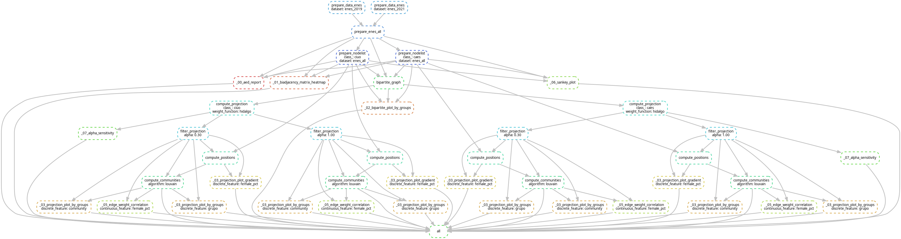

# Labor Market Structure in Argentina

## Author

- Aaron Bernal Huanca (Licenciatura en Ciencia de Datos, FCEyN, UBA)

## Overview

This project builds and analyzes labor-market graphs from ENES datasets.

Pipeline outputs include:

- Processed ENES tables and enriched CAES/CIUO nodelists
- Bipartite graphs (CAES-CIUO)
- Weighted one-mode projections
- Community assignments and position-augmented nodelists
- Visual reports (EDA, heatmaps, projections, edge-correlation, Sankey, alpha-sensitivity)

Orchestration is fully handled by Snakemake via the main `Snakefile` and modular rules under `rules/`.

## Project Layout

```text
labor_market_structure_arg/
├── Snakefile
├── config.yaml
├── requirements.txt
├── rules/
│   ├── 00_prepare.smk
│   ├── 01_bipartite.smk
│   ├── 02_projection.smk
│   └── 03_communities.smk
├── scripts/
│   ├── 00_aed_report.py
│   ├── 01_biadjacency_matrix_heatmap.py
│   ├── 02_bipartite_plot_by_groups.py
│   ├── 03_projection_plot_by_groups.py
│   ├── 03_projection_plot_gradient.py
│   ├── 04_walt_test.py
│   ├── 05_edge_weight_correlation.py
│   ├── 06_sankey_plot.py
│   ├── 07_alpha_sensitivity.py
│   └── utils/
│       ├── prepare_data_enes.py
│       ├── prepare_data_enes_all.py
│       ├── prepare_nodelist_caes.py
│       ├── build_bipartite.py
│       ├── build_projection.py
│       ├── filter_projection.py
│       ├── compute_positions.py
│       └── compute_communities.py
├── src/
│   ├── data_loader.py
│   ├── graph_construction.py
│   ├── communities.py
│   ├── node_characteristics.py
│   ├── plotting.py
│   ├── metrics.py
│   ├── topology.py
│   └── utils.py
├── data/
│   ├── raw/
│   ├── processed/
│   └── graphs/
└── images/
```

## Data Inputs

Expected raw files in `data/raw/`:

- `base_enespersonas.csv` (ENES 2019; downloadable)
- `base_enespersonas_2021.csv` (ESAyPP 2021; add manually)
- `nodelist_caes.csv`
- `nodelist_ciuo.csv`

Main data references:

- ENES PISAC 2019: https://datos.gob.ar/sq/dataset/mincyt-pisac---programa-investigacion-sobre-sociedad-argentina-contemporanea
- ESAyPP 2021: Encuesta sobre Estructura Social y Politicas Publicas 2021

## Installation

Python 3.12.3 is recommended.

```bash
python3 -m venv .venv
source .venv/bin/activate
pip install --upgrade pip
pip install -r requirements.txt
```

## Configuration

Edit `config.yaml` to control:

- Dataset paths and schema mapping
- CAES/CIUO column definitions
- Plot sizes and style parameters
- Random seed

Global execution combinations (datasets, classes, weight functions, alpha values, and target figures) are defined in `Snakefile`.

## Run The Pipeline

Run all configured targets:

```bash
snakemake -j8
```

Force a single output rebuild:

```bash
snakemake -j1 -F images/05_edge_weight_correlation/_enes_all_false_caes_weighted_hidalgo_weight_1.00_pos_louvain_income_mean.png
```

### DAG visualization:

```bash
snakemake --dag | dot -Tpng > images/dag.png
```




## Notes

- `snakemake` must be available in your environment.
- Graph files are written as `.gexf` in `data/graphs/`.
- Intermediate node metadata is written to `data/processed/`.
