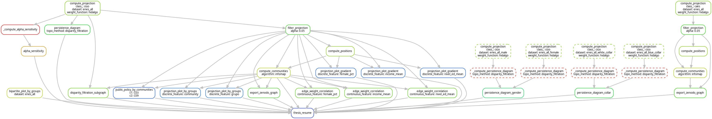

# Labor Market Structure in Argentina
### A Network Analysis of Occupational Mobility Using the ENES and ESAyPP Datasets

**Author:** Aaron Bernal Huanca — Licenciatura en Ciencia de Datos, FCEyN, UBA

[](https://doi.org/10.5281/zenodo.21185520)

---

## Overview

This repository contains the full **Snakemake workflow** used to construct, filter, and analyze
labor-market networks from the ENES (Encuesta Nacional sobre Estructura Social) and
ESAyPP (Encuesta Nacional sobre la Estructura Social de Argentina y Políticas Públicas) datasets.

The workflow:
1. **Prepares** cleaned microdata from ENES 2019, ENES 2021, and EPH (INDEC) survey waves.
2. **Builds bipartite graphs** linking workers to occupational (CIUO-08) or sectoral (CAES-01) categories.
3. **Projects** those graphs onto one mode, weighting edges with the Hidalgo Proximity (or dot product / cosine similarity).
4. **Filters** the projection with the Disparity Filter at a chosen significance threshold α.
5. **Detects communities** (Infomap, Leiden, Louvain) on the filtered backbone.
6. **Produces figures** for every chapter of the thesis: projection plots, gradient maps, persistence diagrams, UMAP, and time-series analyses.

**Key outputs:**
- Bipartite and unipartite backbone graphs in `.gexf` format (compatible with Gephi)
- Community-colored and gradient-colored projection plots (PNG)
- Topological data analysis: persistence diagrams, diagram distances, UMAP
- Alpha-sensitivity and resolution-sensitivity diagnostics
- EPH time-series: preferential attachment exponent, betweenness centrality of AI occupations

---

## Data Availability

> *The raw microdata from ENES 2021 (ESAyPP) are not publicly available.*
> *To ensure topological and algorithmic reproducibility, the processed bipartite graphs*
> *(`data/graphs/enes_all/bipartite.gexf`) and node lists (`data/raw/nodelist_ciuo.csv`,*
> *`data/raw/nodelist_caes.csv`) are provided in this repository.*
> *The ENES 2019 microdata are publicly available at the URL below and will be*
> *downloaded automatically by Snakemake if missing.*

| Dataset | Availability | Source |
|---|---|---|
| ENES PISAC 2019 | 🟢 Public | [datos.gob.ar](https://datos.gob.ar/sq/dataset/mincyt-pisac---programa-investigacion-sobre-sociedad-argentina-contemporanea) |
| ESAyPP 2021 | 🔴 Private | Available upon request |
| EPH (INDEC) | 🟢 Public | [indec.gob.ar](https://www.indec.gob.ar/ftp/cuadros/menusuperior/eph/) |
| Bipartite graphs | 🟢 Included | `data/graphs/enes_all/` |
| Node lists | 🟢 Included | `data/raw/nodelist_*.csv` |

---

## Project Layout

```text
labor_market_structure_arg/
├── Snakefile              ← Pipeline orchestration + top-level target rules
├── config.yaml            ← Configuration + experimentation panel (edit this!)
├── requirements.txt       ← Python dependencies
├── rules/
│   ├── 00_prepare.smk     ← Data preparation (raw → processed CSVs)
│   ├── 01_bipartite.smk   ← Bipartite graph construction (.gexf)
│   ├── 02_projection.smk  ← Projection + Disparity Filter + backbone
│   ├── 03_communities.smk ← Community detection + node positions
│   └── 04_diagrams.smk    ← Topological data analysis (persistence, UMAP)
├── scripts/               ← One Python script per Snakemake rule
├── src/                   ← Shared library (graph utils, plotting helpers)
├── data/
│   ├── raw/               ← Base node lists + raw survey files (see above)
│   ├── graphs/            ← Generated .gexf graphs
│   └── processed/         ← Intermediate CSVs, node lists with community labels
└── images/                ← All output figures (PNG)
```

---

## 1. Environment Setup

Python 3.12+ is recommended. Create an isolated virtual environment:

```bash
python3 -m venv .venv
source .venv/bin/activate
pip install --upgrade pip
pip install -r requirements.txt
```

---

## 2. Reproducing the Manuscript Results

### Quick start — main projection plots

The pipeline defaults to **α = 0.05, Infomap, CIUO-08**, exactly as reported in the thesis.

```bash
snakemake --cores all
```

This generates:
- `images/enes_all/ciuo/03_projection_plot_by_groups/_hidalgo_0.05_pos_infomap_community.png`
- `images/enes_all/ciuo/03_projection_plot_by_groups/_hidalgo_0.05_pos_infomap_grupo.png`
- `images/enes_all/ciuo/03_projection_plot_gradient/_hidalgo_0.05_pos_female_pct.png`
- `images/enes_all/ciuo/03_projection_plot_gradient/_hidalgo_0.05_pos_income_mean.png`
- `images/enes_all/ciuo/03_projection_plot_gradient/_hidalgo_0.05_pos_nivel_ed_mean.png`

### Full thesis — representative outputs (`thesis_resume`)

To reproduce the representative release set (one output per selected pipeline stage), run:

```bash
snakemake thesis_resume --cores all
```

> **Note:** The EPH-dependent rules (Chapters 9, 13, 16) require the pre-calculated EPH bipartite graphs placed in `data/graphs/eph/`.

---

## 3. THESIS_INPUTS — Release Targets from `thesis_resume`

These are the exact targets produced by `snakemake thesis_resume` in the current workflow.

### Static ENES Outputs (always built)

| # | Output path | Description |
|---|---|---|
| 02 | `images/enes_all/02_bipartite_plot_by_groups/bipartite_plot_by_groups.png` | Bipartite graph colored by occupational/sectoral group |
| 03a | `images/enes_all/ciuo/03_projection_plot_by_groups/_hidalgo_0.05_pos_infomap_community.png` | Projection plot — nodes colored by detected community |
| 03b | `images/enes_all/ciuo/03_projection_plot_by_groups/_hidalgo_0.05_pos_infomap_grupo.png` | Projection plot — nodes colored by CIUO-08 major group |
| 03c | `images/enes_all/ciuo/03_projection_plot_gradient/_hidalgo_0.05_pos_female_pct.png` | Gradient plot — share of female workers per occupation |
| 03d | `images/enes_all/ciuo/03_projection_plot_gradient/_hidalgo_0.05_pos_income_mean.png` | Gradient plot — mean log income per occupation |
| 03e | `images/enes_all/ciuo/03_projection_plot_gradient/_hidalgo_0.05_pos_nivel_ed_mean.png` | Gradient plot — mean educational attainment per occupation |
| 03f | `images/enes_all/ciuo/03_communities/_distribution_hidalgo_0.05_infomap.png` | Community size distribution (bar chart) |
| 05a | `images/enes_all/ciuo/05_edge_weight_correlation/_hidalgo_0.05_pos_infomap_female_pct.png` | Edge-weight vs. female % assortativity scatter |
| 05b | `images/enes_all/ciuo/05_edge_weight_correlation/_hidalgo_0.05_pos_infomap_income_mean.png` | Edge-weight vs. mean income assortativity scatter |
| 05c | `images/enes_all/ciuo/05_edge_weight_correlation/_hidalgo_0.05_pos_infomap_nivel_ed_mean.png` | Edge-weight vs. mean education assortativity scatter |
| 07 | `images/enes_all/ciuo/07_alpha_sensitivity/_hidalgo.png` | α-sensitivity: node/edge retention vs. threshold |
| 08a | `images/enes_all/ciuo/08_persistence_diagram/_hidalgo_disparity_filtration.png` | Persistence diagram (H0, H1) — full population |
| 08b | `images/enes_all/ciuo/08_persistence_diagram/_hidalgo_disparity_filtration_gender.png` | Persistence diagrams — male vs. female comparison |
| 08c | `images/enes_all/ciuo/08_persistence_diagram/_hidalgo_disparity_filtration_collar.png` | Persistence diagrams — white-collar vs. blue-collar |
| 18 | `images/enes_all/ciuo/18_disparity_filtration_subgraph/_hidalgo_0.05_pos_infomap_filtration.png` | Step-wise filtration subgraph panels |
| 19 | `images/enes_all/ciuo/19_public_policy_by_communities/_hidalgo_0.05_infomap_C03_C09_betweenness_centrality.png` | Betweenness centrality distribution for communities C03 vs C09 |

### Zenodo Graph Exports (always built)

| Output path | Description |
|---|---|
| `data/enes_all/caes/zenodo_projection_hidalgo_0.05_infomap.gexf` | CAES projection backbone for public release |
| `data/enes_all/ciuo/zenodo_projection_hidalgo_0.05_infomap.gexf` | CIUO projection backbone for public release |

### Dynamic EPH Outputs (built only when `data/graphs/eph/` is populated)

| # | Output path | Description |
|---|---|---|
| 09 | `images/eph/caes/09_alpha_sensitivity/_hidalgo.png` | α-sensitivity across EPH survey waves (CAES) |
| 13 | `images/eph/cno/13_preferential_attachment/_hidalgo.png` | Preferential attachment exponent over EPH waves |
| 16 | `images/eph/cno/16_persistence_diagram_distance/_hidalgo_disparity_filtration_heatmap_wasserstein.png` | Wasserstein distance heatmap across EPH waves |

---

## 4. Wildcard Parameter Reference

All output paths are templated by **wildcards**. Use these tables when building
specific targets via the CLI or when editing `config.yaml`.

### `{dataset}` — Survey Dataset

| Value | Description |
|---|---|
| `enes_all` | ENES 2019 + ENES 2021 combined (weighted) |
| `enes_2019` | ENES PISAC 2019 only (weighted) |
| `esaypp_2021` | ESAyPP 2021 only (weighted) |
| `enes_all_male` | `enes_all` filtered to male respondents |
| `enes_all_female` | `enes_all` filtered to female respondents |
| `enes_all_white_collar` | `enes_all` filtered to non-manual workers |
| `enes_all_blue_collar` | `enes_all` filtered to manual workers |
| `enes_all_unweighted` | `enes_all` without survey weights (raw counts) |
| `enes_2019_unweighted` | `enes_2019` without survey weights |
| `esaypp_2021_unweighted` | `esaypp_2021` without survey weights |
| `enes_all_male_unweighted` | Male subset, unweighted |
| `enes_all_female_unweighted` | Female subset, unweighted |

### `{class_}` — Occupational Classification

| Value | Description |
|---|---|
| `ciuo` | CIUO-08 (ISCO-08) — occupation codes |
| `caes` | CAES-01 — economic activity (sector) codes |
| `cno` | CNO — national occupation classifier (EPH only) |

### `{weight_function}` — Edge Weight Formula

| Value | Description |
|---|---|
| `hidalgo` | Hidalgo Proximity (RCA-based, weighted) — **used in thesis** |
| `unweighted_hidalgo` | Hidalgo Proximity computed on unweighted bipartite graph |
| `dot_product` | Inner product of normalized frequency vectors |
| `cosine` | Cosine similarity of frequency vectors |

### `{alpha}` — Disparity Filter Significance Threshold

Any decimal string matching `\d+\.\d+`, e.g. `0.01`, `0.05`, `0.10`, `0.25`, `1.00`.

| Value | Effect |
|---|---|
| `0.01` | Very strict — retains only the most significant edges (sparse backbone) |
| `0.05` | **Thesis default** — balances sparsity and coverage |
| `0.10` | Moderate threshold |
| `0.25` | Lenient — retains more edges |
| `1.00` | No filtering — equivalent to the full projection |

> **Tip:** Use the α-sensitivity plot (`07_alpha_sensitivity`) to choose an appropriate value for your network.

### `{algorithm}` — Community Detection Algorithm

| Value | Description |
|---|---|
| `infomap` | Infomap — information-theoretic flow-based method (**thesis default**) |
| `leiden` | Leiden — improved modularity optimization |
| `louvain` | Louvain — fast greedy modularity optimization |

### `{discrete_feature}` — Categorical Node Coloring

| Value | Source column | Description |
|---|---|---|
| `community` | `algorithm` output | Detected community label (e.g. C01, C02, …) |
| `grupo` | Nodelist | CIUO-08 major group / CAES-01 sector letter |

### `{continuous_feature}` — Gradient Node Coloring

| Value | Colormap | Description |
|---|---|---|
| `female_pct` | `coolwarm` | Share of female workers in the occupation |
| `income_mean` | `cubehelix` | Mean log individual income |
| `income_median` | `cubehelix` | Median log individual income |
| `income_std` | `YlGnBu` | Standard deviation of log income |
| `nivel_ed_mean` | `gist_stern` | Mean educational attainment level |
| `nivel_ed_std` | `YlGnBu` | Standard deviation of educational level |
| `age_mean` | `magma` | Mean age |
| `age_std` | `YlGnBu` | Standard deviation of age |
| `public_sector_pct` | `magma` | Share of public-sector workers |

### `{topo_method}` — Topological Filtration Method

| Value | Description |
|---|---|
| `disparity_filtration` | Uses Disparity Filter weights as the filtration function (**thesis default**) |
| `shortest_path` | Uses shortest-path distances as the filtration function |

### `{c1}`, `{c2}` — Community Pair (rule 19)

Community labels in the format `C01`–`C39` (zero-padded two digits), e.g. `C03`, `C09`.

---

## 5. Experimenting with Variants

The workflow is fully parameterized. To explore alternative settings,
**edit only the `run_experiments` section** at the bottom of `config.yaml`
— never modify the rest of the file for experimentation.

```yaml
# config.yaml — run_experiments panel
run_experiments:
  datasets_to_build:   ["enes_all"]              # See {dataset} table above
  classes_to_build:    ["ciuo"]                  # See {class_} table above
  alphas_to_build:     ["0.05"]                  # See {alpha} table above
  algorithms_to_build: ["infomap"]               # See {algorithm} table above
  discrete_features:   ["grupo", "community"]    # See {discrete_feature} table above
  continuous_features: ["female_pct", "income_mean", "nivel_ed_mean"]  # See {continuous_feature} table
```

**Example:** Compare Leiden vs Infomap at two α values:

```yaml
run_experiments:
  datasets_to_build:   ["enes_all"]
  classes_to_build:    ["ciuo"]
  alphas_to_build:     ["0.05", "0.25"]
  algorithms_to_build: ["infomap", "leiden"]
  discrete_features:   ["community"]
  continuous_features: ["female_pct"]
```

Then run `snakemake --cores all`. Snakemake detects which targets are missing and
builds only what is needed — existing outputs are not recomputed.

---

## 6. Direct Target CLI Reference

You can request **any single output** without modifying `config.yaml`.
Snakemake resolves the full upstream dependency chain automatically.

### Output path templates

```
images/{dataset}/{class_}/03_projection_plot_by_groups/_{weight_function}_{alpha}_pos_{algorithm}_{discrete_feature}.png
images/{dataset}/{class_}/03_projection_plot_gradient/_{weight_function}_{alpha}_pos_{continuous_feature}.png
images/{dataset}/{class_}/03_communities/_distribution_{weight_function}_{alpha}_{algorithm}.png
images/{dataset}/{class_}/05_edge_weight_correlation/_{weight_function}_{alpha}_pos_{algorithm}_{continuous_feature}.png
images/{dataset}/{class_}/07_alpha_sensitivity/_{weight_function}.png
images/{dataset}/{class_}/08_persistence_diagram/_{weight_function}_{topo_method}.png
images/{dataset}/{class_}/18_disparity_filtration_subgraph/_{weight_function}_{alpha}_pos_{algorithm}_filtration.png
images/{dataset}/{class_}/19_public_policy_by_communities/_{weight_function}_{alpha}_{algorithm}_{c1}_{c2}_betweenness_centrality.png
```

### Example commands

**Projection plot — community colors, Infomap, α = 0.05 (thesis default):**
```bash
snakemake -j4 "images/enes_all/ciuo/03_projection_plot_by_groups/_hidalgo_0.05_pos_infomap_community.png"
```

**Projection plot — CIUO major group colors, α = 0.10, Leiden:**
```bash
snakemake -j4 "images/enes_all/ciuo/03_projection_plot_by_groups/_hidalgo_0.10_pos_leiden_grupo.png"
```

**Gradient plot — female share, α = 0.05:**
```bash
snakemake -j4 "images/enes_all/ciuo/03_projection_plot_gradient/_hidalgo_0.05_pos_female_pct.png"
```

**Gradient plot — mean income, CAES sectors:**
```bash
snakemake -j4 "images/enes_all/caes/03_projection_plot_gradient/_hidalgo_0.05_pos_income_mean.png"
```

**Community size distribution:**
```bash
snakemake -j4 "images/enes_all/ciuo/03_communities/_distribution_hidalgo_0.05_infomap.png"
```

**Edge-weight correlation with educational level:**
```bash
snakemake -j4 "images/enes_all/ciuo/05_edge_weight_correlation/_hidalgo_0.05_pos_infomap_nivel_ed_mean.png"
```

**α-sensitivity plot:**
```bash
snakemake -j4 "images/enes_all/ciuo/07_alpha_sensitivity/_hidalgo.png"
```

**Persistence diagram — full population:**
```bash
snakemake -j4 "images/enes_all/ciuo/08_persistence_diagram/_hidalgo_disparity_filtration.png"
```

**Persistence diagram — gender comparison:**
```bash
snakemake -j4 "images/enes_all/ciuo/08_persistence_diagram/_hidalgo_disparity_filtration_gender.png"
```

**Disparity filtration subgraph panels:**
```bash
snakemake -j4 "images/enes_all/ciuo/18_disparity_filtration_subgraph/_hidalgo_0.05_pos_infomap_filtration.png"
```

**Public policy analysis — communities C03 vs C09:**
```bash
snakemake -j4 "images/enes_all/ciuo/19_public_policy_by_communities/_hidalgo_0.05_infomap_C03_C09_betweenness_centrality.png"
```

**Projection plot — female subset of ENES:**
```bash
snakemake -j4 "images/enes_all_female/ciuo/03_projection_plot_by_groups/_hidalgo_0.05_pos_infomap_community.png"
```

> **Tip:** Replace `-j4` with `-j1` for a single core or `--cores all` to use all available CPUs.

---

## 7. Pipeline Utilities

**Visualize the execution DAG:**
To visualize the full Directed Acyclic Graph (DAG) including all rules (even already completed ones), use `--forceall`:
```bash
snakemake --forceall --dag thesis_resume | dot -Tpng -o thesis_resume_dag.png
```

**Workflow DAG Visualization:**



**Dry run — show what would be built without executing:**
```bash
snakemake --dryrun --cores all
```

**Force rebuild of a specific output:**
```bash
snakemake --cores 4 -F "images/enes_all/ciuo/07_alpha_sensitivity/_hidalgo.png"
```

**Parallel execution with incomplete-run recovery:**
```bash
snakemake --cores all --rerun-incomplete
```

**GPU acceleration (optional, for large graphs):**
```bash
sudo apt install nvidia-cuda-toolkit
pip install nx-cugraph-cu13
export CUDA_PATH=/usr
```

---

## Citation

If you use this workflow in your research, please cite:

```bibtex
@misc{bernal2026labormarket,
	author    = {Bernal Huanca, Aaron},
	title     = {Occupational and Industry Networks: A Network Analysis of the Labor Market Structure},
	year      = {2026},
	publisher = {Zenodo},
	doi       = {10.5281/zenodo.21185520},
	url       = {https://doi.org/10.5281/zenodo.21185520}
}
```
